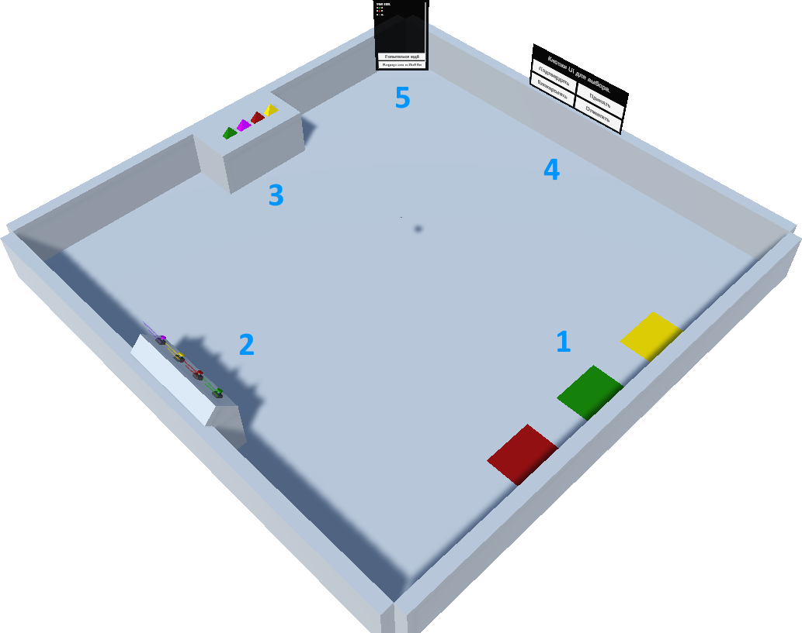

# Тестовое задание PromVR by Dan398
Необходимо было создать VR приложение, отслеживающее и регистрирующее события, создаваемые пользователем на сцене, и учёт событий в эпапах прохождения импровизированных сценариев.

 **Как это работает:** Есть источники событий (ниже 1-4), регистрируемые в Event Loop. К нему подключен процессор (5), который учитывает приходящие события.

Сцена "Training" представляет из себя следующее:
 
1. Зоны для подхода. На них можно встать и/или телепортироваться. Создают события типа "Подойти".
2. Нажимаемые кнопки. Доступно как нажатие контроллером, так и активация через кнопку Grab на контроллерах. Создают события типа "Нажать на физическую кнопку".
3. Подбираемые объекты. При подборе создают события типа "Граб".
4. Кнопки интерфейса. Создают события типа "Нажать кнопку".
5. Интерфейс работы с группами шагов. На нём отрисовывается прогресс выполнения шага, либо, при выполнении всех шагов, краткий результат прохождения и предложения либо перейти в сцену "Лобби", либо запустить прохождение заново.
